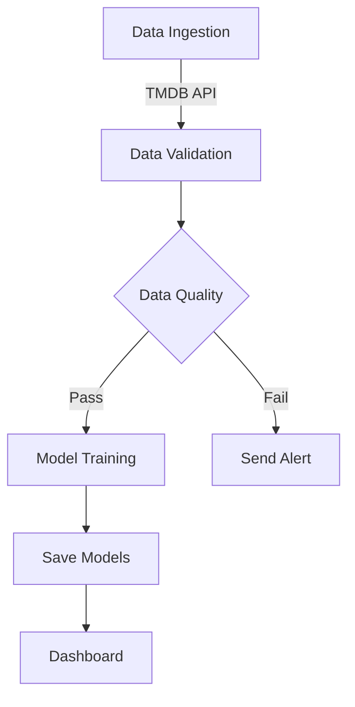

# TMDB Movie Recommender 🎬


[](LICENSE)

A robust movie recommendation system powered by TMDB data with automated data pipelines, content-based filtering, and an interactive dashboard.

## Features ✨
- **Automated Data Ingestion** - Scheduled daily updates from TMDB API
- **Content-Based Filtering** - TF-IDF vectorization for accurate recommendations
- **Self-Healing Pipeline** - Automatic fallback to sample data when API fails
- **Data Quality Monitoring** - Validation checks with email alerts
- **Lightning Fast Queries** - DuckDB database for efficient storage
- **Interactive Dashboard** - Streamlit interface with movie posters

## Getting Started 🚀

### Prerequisites
- Python 3.9+
- TMDB API key (free at [themoviedb.org](https://www.themoviedb.org/settings/api))
- Git

### Installation
```bash
# Clone repository
git clone https://github.com/your-username/tmdb-movie-recommender.git
cd tmdb-movie-recommender

# Create virtual environment
python -m venv venv
source venv/bin/activate  # Linux/MacOS
venv\Scripts\activate    # Windows

# Install dependencies
pip install -r requirements.txt
```

### Configuration
1. Create `.env` file from template:
   ```bash
   cp .env.sample .env
   ```
2. Edit `.env` with your credentials:
   ```ini
   TMDB_API_KEY="your_api_key_here"
   # Optional for email alerts:
   ALERT_EMAIL_USER="your@email.com"
   ALERT_EMAIL_PASS="app_password"
   ```

## Usage 🖥️

### Run Full Pipeline
```bash
python pipelines/movie_pipeline.py
```

### Individual Components
```bash
# Data ingestion
python scripts/data_ingestion.py

# Model training
python scripts/model_training.py

# Data monitoring
python scripts/monitoring.py

# Launch dashboard
streamlit run dashboard/app.py
```

### Daemon Mode (Continuous Updates)
```bash
python scripts/data_ingestion.py --daemon
```

## Docker Support 🐳
```bash
# Build image
docker build -f docker/Dockerfile -t movie-recommender .

# Run container
docker run -p 8501:8501 --env-file .env movie-recommender
```

## Dashboard Preview 🎥

*Interactive interface showing movie recommendations and filters*

## Workflow Diagram 🔄


## Configuration Options ⚙️
| Environment Variable | Default              | Purpose                          |
|----------------------|----------------------|----------------------------------|
| `TMDB_API_KEY`       | **Required**         | TMDB API access key              |
| `HTTP_PROXY`         | None                 | Proxy configuration for API calls|
| `HTTPS_PROXY`        | None                 | Proxy configuration for API calls|
| `ALERT_EMAIL_USER`   | None                 | Email for data quality alerts    |
| `ALERT_EMAIL_PASS`   | None                 | Email app password               |
| `ALERT_RECIPIENT`    | ALERT_EMAIL_USER     | Alert notification recipient     |

## Troubleshooting 🛠️
**Problem**: API requests failing  
**Solution**: Verify your TMDB API key and network connection

**Problem**: Missing movie posters  
**Solution**: Check internet connection and TMDB image service status

**Problem**: Database version errors  
**Solution**: Delete `data/movies.duckdb` and re-run ingestion

## Contributing 🤝
1. Fork the repository
2. Create your feature branch (`git checkout -b feature/amazing-feature`)
3. Commit your changes (`git commit -m 'Add amazing feature'`)
4. Push to the branch (`git push origin feature/amazing-feature`)
5. Open a pull request

## License 📄
This project is licensed under the MIT License - see the [LICENSE](LICENSE) file for details.

## Acknowledgments 🙏
- Data provided by [The Movie Database](https://www.themoviedb.org/)
- Powered by [Streamlit](https://streamlit.io), [Prefect](https://prefect.io), and [DuckDB](https://duckdb.org)
