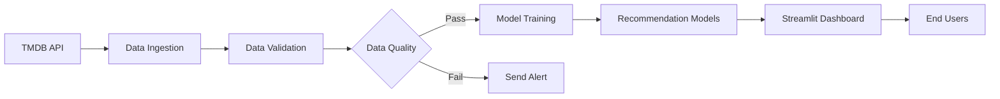

# TMDB Movie Recommender 

[](#)
[](#)
[](#)
[](#)
[](#)
[&labelColor=FFFFFF&color=rgb(77%2C%20171%2C%20207))](#)
[](#)
[](#)
[](LICENSE)

A robust movie recommendation system powered by TMDB data with automated data pipelines, content-based filtering, and an interactive dashboard. This project demonstrates a complete machine learning workflow from data ingestion to model deployment.

## Key Features
- **Automated Data Pipeline** - Scheduled daily updates from TMDB API
- **Content-Based Recommendations** - TF-IDF vectorization for accurate suggestions
- **Self-Healing Architecture** - Automatic fallback to sample data during API failures
- **Data Quality Monitoring** - Validation checks with email alert system
- **Lightning Fast Storage** - DuckDB database for efficient query performance
- **Interactive Dashboard** - Streamlit interface with movie posters
- **Containerized Deployment** - Docker support for seamless deployment
- **Workflow Orchestration** - Prefect pipeline for end-to-end automation

## System Architecture


## Getting Started

### Prerequisites
- Python 3.10+
- TMDB API key ([free account](https://www.themoviedb.org/settings/api))
- Docker (optional)

### Installation
```bash
# Clone repository
git clone https://github.com/your-username/tmdb-movie-recommender.git
cd tmdb-movie-recommender

# Create virtual environment
python -m venv venv
source venv/bin/activate  # Linux/MacOS
venv\Scripts\activate    # Windows

# Install dependencies
pip install -r requirements.txt
```

### Configuration
1. Create environment file:
   ```bash
   cp .env.sample .env
   ```
2. Edit `.env` with your credentials:
   ```ini
   # Required configuration
   TMDB_API_KEY="your_api_key_here"
   
   # Optional email alerts
   ALERT_EMAIL_USER="your@email.com"
   ALERT_EMAIL_PASS="app_password"
   ```

## Usage Guide

### Running the Full Pipeline
```bash
python pipelines/movie_pipeline.py
```

### Individual Components
| Component | Command | Description |
|-----------|---------|-------------|
| Data Ingestion | `python scripts/data_ingestion.py` | Fetches movie data from TMDB API |
| Model Training | `python scripts/model_training.py` | Trains recommendation models |
| Data Monitoring | `python scripts/monitoring.py` | Performs data quality checks |
| Dashboard | `streamlit run dashboard/app.py` | Launches recommendation UI |

### Continuous Operation Mode
```bash
python scripts/data_ingestion.py --daemon
```

## Docker Deployment
```bash
# Build Docker image
docker build -f docker/Dockerfile -t movie-recommender .

# Run container with persistent storage
docker run -d \
  -p 8501:8501 \
  -v ./data:/app/data \
  -v ./models:/app/models \
  --env-file .env \
  --name movie-rec \
  movie-recommender
```
Access dashboard at: http://localhost:8501

## Dashboard Features
- **Interactive Filters** - Filter by release year and minimum rating
- **Movie Recommendations** - Get personalized suggestions based on content similarity
- **Top Rated Movies** - Discover highest rated films with visual ratings
- **Database Explorer** - Browse all movies in a sortable table
- **System Monitoring** - View dataset statistics and model version


*Interactive dashboard showing movie recommendations and filters*

## Configuration Options
| Environment Variable | Required | Default | Purpose |
|----------------------|----------|---------|---------|
| `TMDB_API_KEY`       | Yes      | -       | TMDB API access key |
| `HTTP_PROXY`         | No       | None    | HTTP proxy configuration |
| `HTTPS_PROXY`        | No       | None    | HTTPS proxy configuration |
| `ALERT_EMAIL_USER`   | No       | None    | Email for data quality alerts |
| `ALERT_EMAIL_PASS`   | No       | None    | Email app password |
| `ALERT_RECIPIENT`    | No       | Same as user | Alert notification recipient |

## Troubleshooting Guide
| Issue | Solution |
|-------|----------|
| API requests failing | Verify TMDB_API_KEY in .env file |
| Missing movie posters | Check internet connection and TMDB image service |
| Database version errors | Delete `data/movies.duckdb` and re-run ingestion |
| Email alerts not working | Verify app password and enable less secure apps |
| Docker build failing | Ensure Docker has at least 2GB memory allocation |

## Contribution Guidelines
1. Report issues in GitHub tracker
2. Fork repository and create feature branches
3. Submit pull requests with detailed descriptions
4. Follow PEP 8 coding standards
5. Update documentation for new features

## License
This project is licensed under the MIT License - see the [LICENSE](LICENSE) file for details.

## Acknowledgments
- Movie data provided by [The Movie Database](https://www.themoviedb.org/)
- Powered by [Streamlit](https://streamlit.io), [Prefect](https://prefect.io), and [DuckDB](https://duckdb.org)
- Inspired by similar recommender systems from Netflix and Hulu
